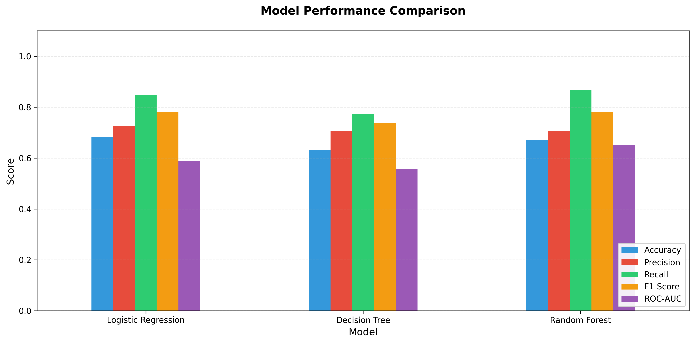
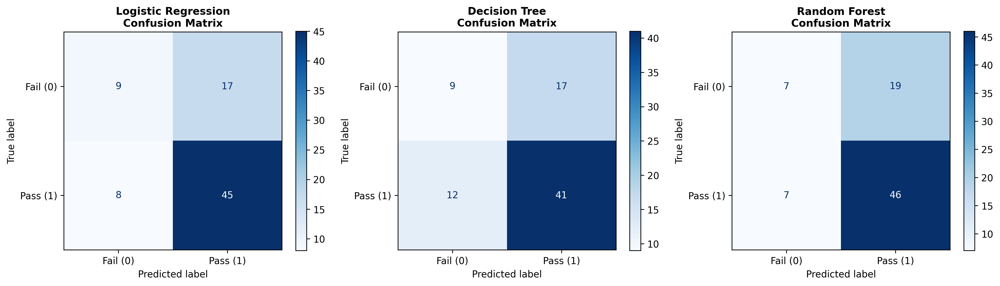
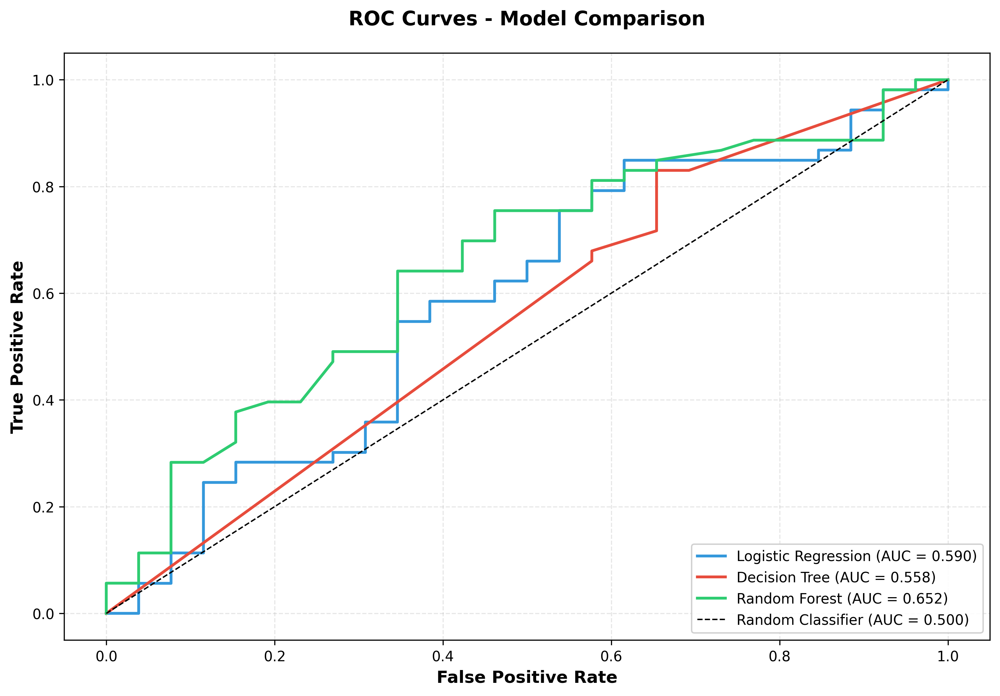
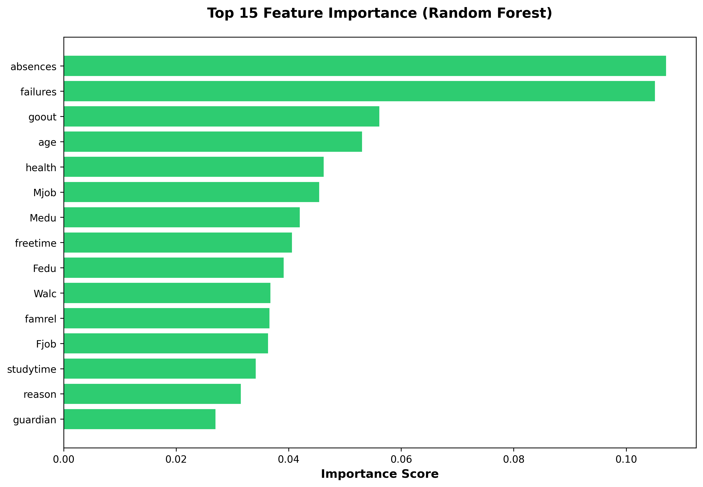
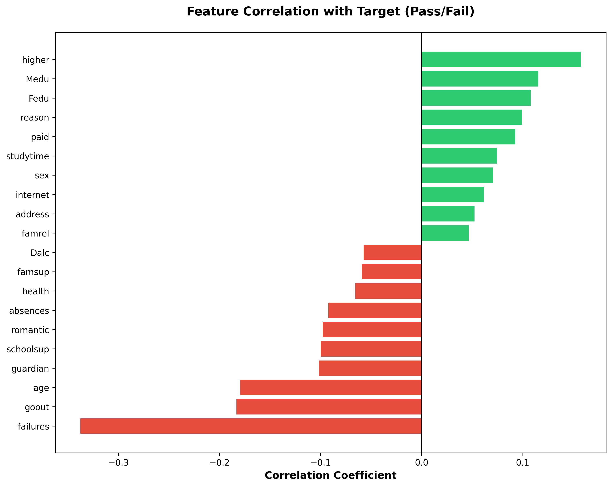

# Student Performance Prediction Using Machine Learning

This project builds and evaluates machine learning models to predict whether a student will **pass or fail** based on academic, demographic, and behavioral features. The goal is to help educators identify at-risk students early and enable timely interventions.

## 1. Project Overview

**Problem:**  
Educational institutions often detect struggling students too late, after final exam results are declared.

**Goal:**  
Use data-driven ML models to predict final performance (pass/fail) before the end of the term.

**Dataset:**  
`student-mat.csv` (Math students) from the [UCI Student Performance Dataset](https://archive.ics.uci.edu/dataset/320/student+performance).

**Target Variable:**
- `1` → **Pass** (final grade G3 ≥ 10)
- `0` → **Fail** (final grade G3 < 10)

**Key Research Questions:**
- Which students are most likely to fail and need support?
- Which factors (attendance, prior failures, study time, etc.) influence performance the most?
- Which ML model provides the best balance of accuracy and reliability?


## 2. Dataset

**Source:** [UCI Machine Learning Repository](https://archive.ics.uci.edu/dataset/320/student+performance) – Student Performance Dataset (Math course)

**Dataset Overview:**
- **Rows:** 395 students
- **Columns:** 33 original features + 1 derived target variable

**Feature Categories:**

| Category | Examples |
|----------|----------|
| **Demographic** | age, sex, address, family size, parental cohabitation status |
| **Parental Background** | Mother's education, Father's education, Mother's job, Father's job |
| **Academic** | Study time, Past failures, Previous grades (G1, G2, G3) |
| **Behavioral** | Frequency of going out, Daily alcohol consumption, Weekend alcohol consumption, Absences |
| **Support & Activities** | School support, Family support, Extra paid classes, Participation in activities, Internet access |

**Data Preprocessing:**
- G3 (final grade) is used **only to create the target**, then dropped
- G1 and G2 (previous grades) are also dropped to prevent **data leakage** and focus on behavioral/demographic factors


## 3. Methodology

The following pipeline is implemented in the Jupyter notebook:

### Data Loading
- Read `student-mat.csv` with semicolon (`;`) as the field separator

### Data Cleaning & Target Creation
- Verified no missing values in the dataset
- Created binary target column:
  - `1` if G3 ≥ 10 (Pass)
  - `0` if G3 < 10 (Fail)

### Feature Selection
- Dropped G1, G2, and G3 to prevent data leakage
- Retained 30 behavioral and demographic features

### Encoding & Scaling
- Applied **Label Encoding** to all categorical features
- Split data into train/test sets (80/20) with stratification on target
- Applied **StandardScaler** to numeric features (used for Logistic Regression)

### Model Training
Trained three baseline classifiers:
- Logistic Regression
- Decision Tree
- Random Forest

### Model Evaluation
Evaluated all models using:
- **Accuracy** – Overall correctness
- **Precision** – False positive rate control
- **Recall** – False negative rate control
- **F1-Score** – Harmonic mean of precision and recall
- **ROC-AUC** – Class separation capability
- Confusion matrices and ROC curves

### Model Optimization
- Performed **GridSearchCV** on Random Forest to optimize F1-Score

### Interpretability
- Computed feature importance rankings (Random Forest)
- Analyzed feature correlation with pass/fail outcome


## 4. Models & Evaluation Metrics

**Models Trained:**
- Logistic Regression (baseline)
- Decision Tree (baseline)
- Random Forest (baseline)
- Random Forest (tuned via GridSearchCV)

**Evaluation Metrics:**

| Metric | Definition |
|--------|-----------|
| **Accuracy** | Overall percentage of correct predictions |
| **Precision** | True passes / (True passes + False passes) |
| **Recall** | True passes / (True passes + False negatives) |
| **F1-Score** | Harmonic mean of precision and recall; primary comparison metric |
| **ROC-AUC** | Area under the ROC curve; ability to separate classes across thresholds |

*Exact performance scores are available in the notebook and visualization charts.*


## 5. Results & Visualizations

All visualizations are generated during notebook execution.

### 5.1 Model Performance Comparison
Comparative bar chart showing Accuracy, Precision, Recall, F1-Score, and ROC-AUC across all models on the test set.



### 5.2 Confusion Matrices
Detailed confusion matrices for Logistic Regression, Decision Tree, and Random Forest, showing true/false positives and negatives.



### 5.3 ROC Curves
ROC curves illustrating the trade-off between true positive rate and false positive rate for each model, with corresponding AUC scores.



### 5.4 Feature Importance (Random Forest)
Bar plot ranking the top features influencing predictions (e.g., failures, absences, study time, etc.).



### 5.5 Feature Correlation with Target
Heatmap showing features with the strongest positive and negative correlation with pass/fail outcomes.




## 6. Project Structure

```
.
├── README.md                                  # Project documentation
├── data/
│   └── student-mat.csv                        # UCI Student Performance dataset (Math)
├── notebooks/
│   └── Student_Performance_Prediction_FA2.ipynb  # Main analysis notebook
├── images/                                    # Generated visualizations
│   ├── model_comparison.png
│   ├── confusion_matrices.png
│   ├── roc_curves.png
│   ├── feature_importance.png
│   └── feature_correlation.png
└── student_performance_model.pkl              # Trained model (saved during execution)
```

## 7. Getting Started

### Prerequisites
- Python 3.7+
- Jupyter Notebook or VS Code with Jupyter extension

### Installation

**1. Clone the repository:**
```bash
git clone git remote add origin https://github.com/harryongit/Student_Performance_Prediction.git
cd Student_Performance_Prediction
```

**2. Install dependencies:**
```bash
pip install -r requirements.txt
```

Or manually install the required packages:
```bash
pip install pandas numpy scikit-learn matplotlib seaborn
```

**3. Open the notebook:**

Using Jupyter:
```bash
jupyter notebook notebooks/Student_Performance_Prediction_FA2.ipynb
```

Or open directly in VS Code and execute cells.

### Running the Analysis
1. Execute all cells in the notebook from top to bottom
2. The notebook will:
   - Load and preprocess the dataset
   - Train all models
   - Generate evaluation metrics and visualizations
   - Save the trained model as `student_performance_model.pkl`


## 8. Key Findings

- **Class Imbalance:** The dataset is moderately imbalanced, with approximately two-thirds of students passing and one-third failing.

- **Model Performance:** Logistic Regression and Random Forest achieve strong F1-Scores and ROC-AUC values, making them reliable for building early-warning systems in educational settings.

- **Most Influential Features:** 
  - Number of past failures
  - Frequency of absences
  - Amount of study time
  - Alcohol consumption (weekend)

- **Practical Application:** Models can identify at-risk students early, enabling educators to provide targeted support and intervention.


## 9. Future Enhancements

Potential extensions for this project:

- **Class Imbalance:** Apply SMOTE, class weights, or other resampling techniques for more robust handling of imbalanced data
- **Advanced Models:** Explore XGBoost, Gradient Boosting, and Neural Networks for potentially better performance
- **Explainability:** Integrate SHAP values for instance-level explanations of individual predictions
- **Deployment:** Build a web dashboard enabling educators to upload student data and receive risk predictions
- **Feature Engineering:** Develop composite features and domain-specific indicators
- **Cross-validation:** Implement k-fold cross-validation for more reliable evaluation metrics
- **Hyperparameter Tuning:** Extend GridSearchCV to other models beyond Random Forest

---

## 10. License & Attribution

This project uses the [UCI Student Performance Dataset](https://archive.ics.uci.edu/dataset/320/student+performance).

## Repository

**GitHub Repository:** [harryongit/Student_Performance_Prediction](https://github.com/harryongit/Student_Performance_Prediction)

```
https://github.com/harryongit/Student_Performance_Prediction.git
```

## Contact

For questions or contributions, please reach out or submit an issue in the [repository](https://github.com/harryongit/Student_Performance_Prediction).

